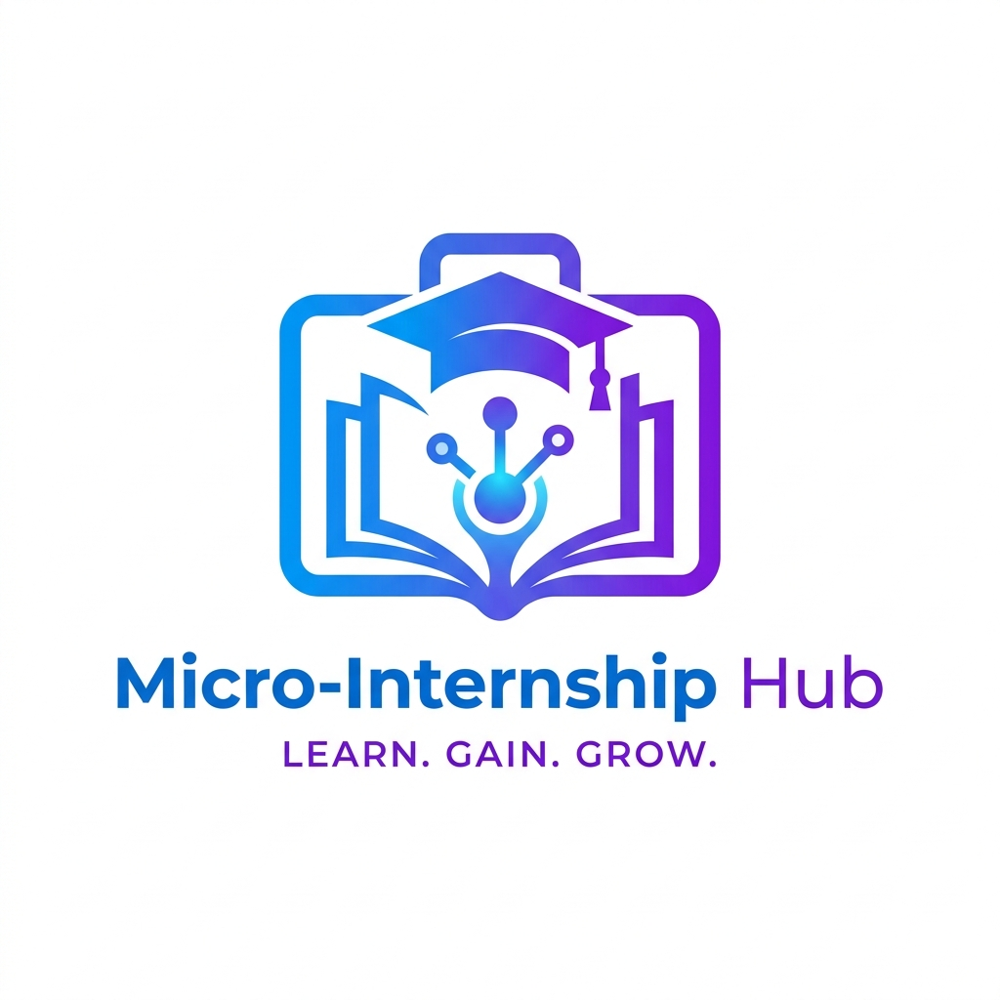
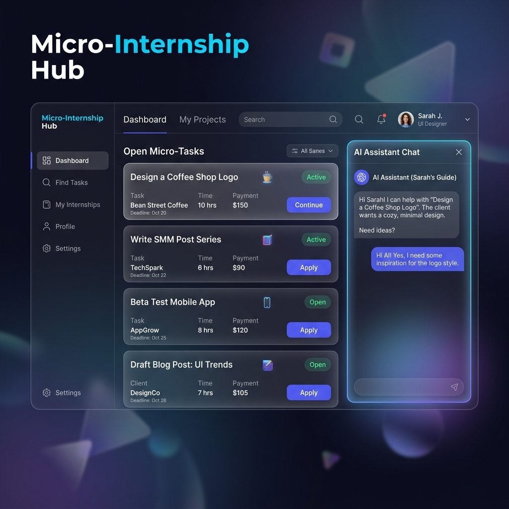

# "Micro-Internship Hub" ЖИ-Платформасы 

## 1. Жобаның Мақсаты мен Мәселесі
**Мәселе:** Жұмыс берушілер «тәжірибесі бар» мамандарды іздейді, ал жаңа бітірген жастарда ол жоқ. Бұл "тұйық шеңбер" мәселесі көптеген жастардың жұмысқа орналасуына кедергі келтіреді.
**Шешім:** Жастарға арналған «Micro-Internship Hub» платформасы. Студенттер ЖИ (Жасанды Интеллект) көмегімен нақты компаниялардың кішігірім кейстерін шешіп, өздеріне «цифрлық портфолио» жинайды.

## 2. Қолданылған Технологиялар мен ЖИ Құралдары
Бұл жоба толықтай **No-Code (код жазбай)** принциптеріне негізделіп, ЖИ-агенттерді (Agentic AI) басқару арқылы жасалды.

* **ЖИ-Бағдарламашы:** Google Gemini Advanced (барлық кодты, логиканы және архитектураны нөлден жазып шықты).
* **Платформадағы ЖИ-Тәлімгер:** OpenAI API (GPT-4o моделі) - бағалаушы әрі ментор.
* **Дизайн мен Визуал:** AI Image Generator (Google Imagen / DALL-E 3) арқылы логотип пен макет жасалды.
* **Frontend:** React JS (Vite), CSS (Glassmorphism стилі).
* **Backend & DB:** Supabase (PostgreSQL, Auth жүйесі).
* **Хостинг:** Vercel (CI/CD арқылы автоматты жариялау).

## 3. Платформа интерфейсі (UI/UX)
Платформа заманауи мөлдір (Glassmorphism) стилінде жасалған. 

## 4. Платформаның Негізгі Функциялары және Жасалу Барысы

### 1) Басты бет және Авторизация (Landing & Auth)
* Басты бетте жобаның концепциясы көрсетілген.
* Supabase Auth арқылы қауіпсіз кіру/тіркелу жүйесі орнатылған. 
* *Қауіпсіздік ескертпесі:* Студенттер үшін электрондық поштаны растаусыз (Auto-Confirm) кіру конфигурацияланды.

### 2) Тапсырмалар Тақтасы (Dashboard)
Бизнес өкілдері және жүйе әкімшілері қосқан әртүрлі 9 бағыттағы тапсырмалар (MOCK_TASKS) көрсетіледі:
1. Инвесторларға презентация (Pitch Deck)
2. Instagram контент-жоспар
3. Excel деректерді өңдеу
4. Landing Page кодын жазу (React)
5. SEO мақала жазу
6. Бәсекелестерге талдау жасау
7. TikTok / Reels видео-монтаж
8. Python арқылы парсер жазу
9. Кофеханаға логотип жасау

### 3) Жұмыс Кеңістігі және ЖИ-Эвалюатор (Task Workspace)
Кез келген тапсырманы таңдағанда арнайы жұмыс беті ашылады:
* **Сол жақта (Жұмыс алаңы):** Студент тапсырманың толық сипаттамасын оқып, төмендегі үлкен өріске өзінің жұмыс нәтижесін, кодын немесе сілтемесін енгізеді.
* **"ЖИ-Эвалюатор" батырмасы:** Студент жұмысты жіберген бойда, GPT-4o моделі жұмысты анализдеп, **100 баллдық жүйемен әділ баға қояды** және қателерін түсіндіреді. Мұғалімнің тексеру жұмысы 100% автоматтандырылған.
* **Оң жақта (ЖИ Чат):** Студент жұмыс барысында қиналса, ЖИ-ассистенттен сұрақ сұрай алады.

## 5. Демонстрация (Видео)
Төменде платформаның жұмыс істеу процесінің қысқаша видео-демосы көрсетілген (Оны GitHub-тан тікелей көруге болады):

## 6. Сыни Рефлексия және ЖИ Этикасы
Жобаны құру барысында ескерілген негізгі этикалық мәселе: *"Студенттер тапсырманы өздері жасамай, ЖИ-ға істете салмай ма?"*
**Біздің шешім:** Жүйедегі GPT-4o моделіне арнайы қатаң (System Prompt) нұсқаулық берілді. Ол студентке дайын жауапты бермейді, тек бағыт-бағдар беретін ментор (тәлімгер) ретінде жұмыс істейді. Ал бағалау кезінде өте қатаң, бірақ әділ кері байланыс береді. 

**Болашақта қосылатын функциялар (Future Updates):**
* **Геймификация:** Студенттердің тапсырма орындап, "XP" жинап деңгейін өсіруі.
* **Рейтинг:** Бизнес иелерінің студенттерге жұлдызшамен баға беруі.
* **Түйіндеме генераторы:** Сәтті орындалған кейстер негізінде автоматты түрде резюме құрастыру.

---
**GitHub Репозиторийі:** `https://github.com/Disaaaaaaa/micri`

**Vercel Live URL:** `https://micri.vercel.app/`
